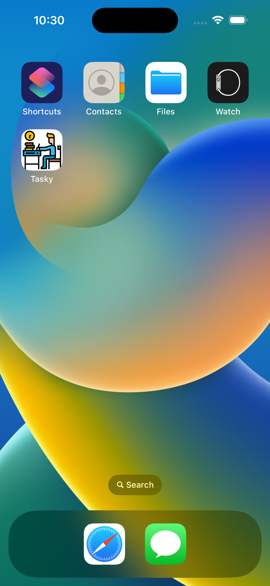
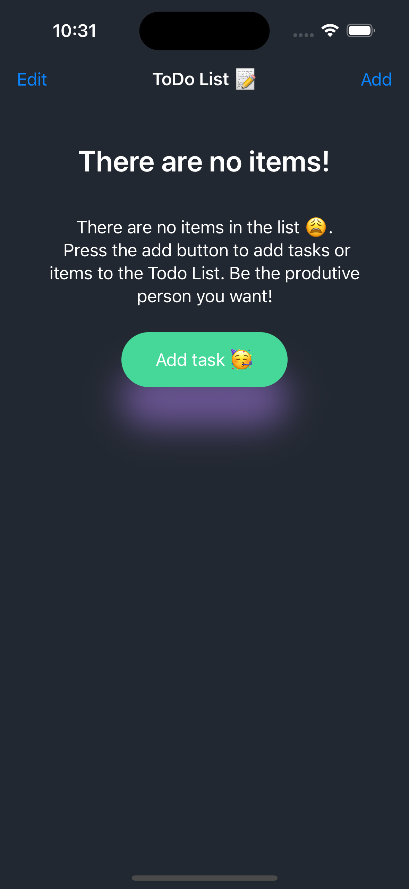
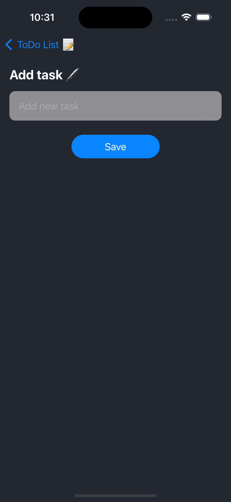
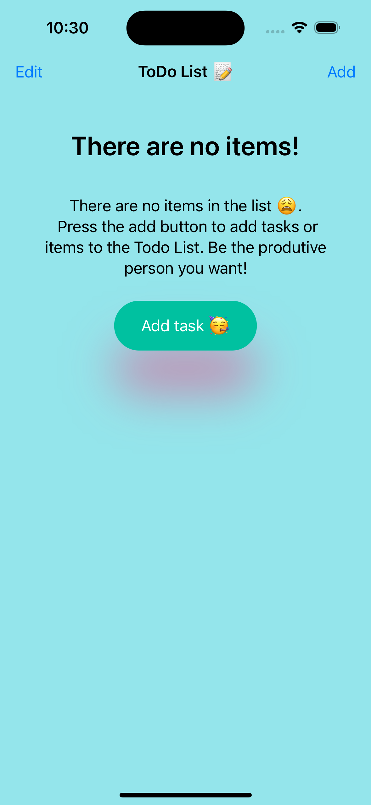
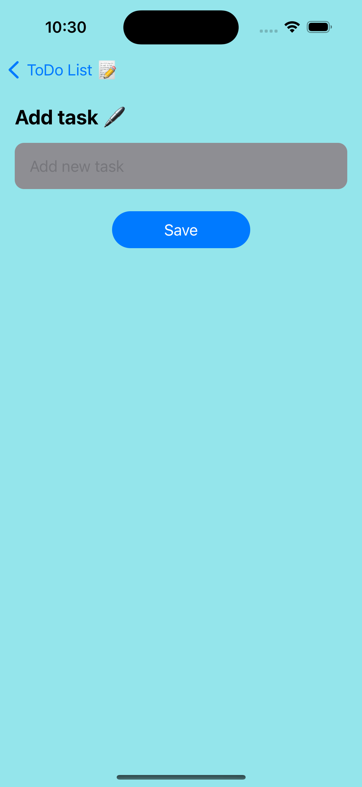

# ToDo-App
A todo app built using swiftUI and makes use of user defaults to save user data locally to the application.
I used user defaults in place of core data to store the user data.
This keeps the users data even after the application gets closed

## App icon 

## Home screen in dark mode

## Add task view in dark mode

## Home screen in light mode

## Add task view in light mode

